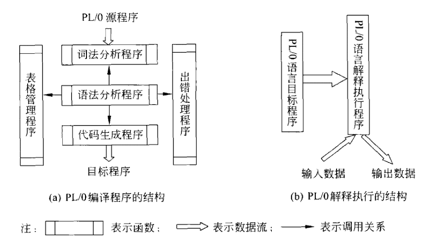

## 编译原理大作业（PL/0编译器与P-Code解释器）

### 写在前面

本项目开源，如有雷同，不是我的问题。仓库地址为 https://github.com/Aur3l14no/CompilerLabOnline 

本项目用Python编写编译器部分，用Flask实现网页UI，DEMO地址为 http://139.199.104.107:4000/

### 环境 & 运行

Python 3.6 + Flask

执行 `python3 web.py` 即可启动

### 作业要求

#### 具体要求

- 文件输入：符合PL/0文法的源程序（自己要有5个测试用例，包含出错的情况，还要用老师提供的测试用例进行测试）
- 输出：P-Code
- 错误信息：参见教材第316页表14.4（新书第411页表17.4）。
- 错误信息尽量详细（行号，错误类型）
- P-Code指令集：参见教材第351页表15.14。
- 语法分析部分要求统一使用递归下降子程序法实现。
- 编程语言自定，可使用C、C++、C#或Java等。（尽量选用有可执行文件的）
- 上交材料中不但要包括源代码（含注释）和可执行程序，还应有完整文档。

#### 加分项
- 解释程序
- GUI界面

#### 成绩评定
占实验课总成绩60%，P-Code的输出正确，出错处理正确

### PL/0文法

#### PL/0文法简介

```
<程序> ::= <分程序>.
<分程序> ::= [<常量说明部分>][变量说明部分>][<过程说明部分>]<语句>
<常量说明部分> ::= const<常量定义>{,<常量定义>};
<常量定义> ::= <标识符>=<无符号整数>
<无符号整数> ::= <数字>{<数字>}
<标识符> ::= <字母>{<字母>|<数字>}
<变量说明部分>::= var<标识符>{,<标识符>};
<过程说明部分> ::= <过程首部><分程序>;{<过程说明部分>}
<过程首部> ::= procedure<标识符>;
<语句> ::= <赋值语句>|<条件语句>|<当型循环语句>|<过程调用语句>|<读语句>|<写语句>|<复合语句>|<重复语句>|<空>
<赋值语句> ::= <标识符>:=<表达式>
<表达式> ::= [+|-]<项>{<加法运算符><项>}
<项> ::= <因子>{<乘法运算符><因子>}
<因子> ::= <标识符>|<无符号整数>|'('<表达式>')'
<加法运算符> ::= +|-
<乘法运算符> ::= *|/
<条件> ::= <表达式><关系运算符><表达式>|odd<表达式>
<关系运算符> ::= =|<>|<|<=|>|>=
<条件语句> ::= if<条件>then<语句>[else<语句>]
<当型循环语句> ::= while<条件>do<语句>
<过程调用语句> ::= call<标识符>
<复合语句> ::= begin<语句>{;<语句>}end
<重复语句> ::= repeat<语句>{;<语句>}until<条件>
<读语句> ::= read'('<标识符>{,<标识符>}')'
<写语句> ::= write'('<标识符>{,<标识符>}')'
<字母> ::= a|b|...|X|Y|Z
<数字> ::= 0|1|2|...|8|9
```

#### PL/0文法理解

- PL/0文法中，函数调用是没有传参的，设计目标代码生成时需要注意。
- 本文法中，写语句中为标识符，但wiki给出的文法中是表达式。考虑到单独的标识符也可以视作表达式，故选择按照 <写语句> ::= write'('<表达式>{,<表达式>}')' 实现。这样更具一般性。
- procedure是允许嵌套定义的，在设计编译时记录表时需要注意。

#### 递归下降法语义分析状态机示意图


### P-Code目标代码

#### 代码结构

P-code 语言：一种栈式机的语言。此类栈式机没有累加器和通用寄存器，有一个栈式存储器，有四个控制寄存器（指令寄存器 I，指令地址寄存器 P，栈顶寄存器 T和基址寄存器 B），算术逻辑运算都在栈顶进行。

指令格式：<操作码f> <层次差l> <参数a>

| 指令      | 具体含义                                |
| ------- | ----------------------------------- |
| LIT 0,a | 取常量a放到数据栈栈顶                         |
| OPR 0,a | 执行运算，a表示执行何种运算(+ - * /)，a为0时为return |
| LOD l,a | 取变量放到数据栈栈顶(相对地址为a,层次差为l)            |
| STO l,a | 将数据栈栈顶内容存入变量(相对地址为a,层次差为l)          |
| CAL l,a | 调用过程(入口指令地址为a,层次差为l)                |
| INT 0,a | 数据栈栈顶指针增加a                          |
| JMP 0,a | 无条件转移到指令地址a                         |
| JPC 0,a | 条件转移到指令地址a                          |

### 编译 & 解释系统结构

#### 综述

整体结构如下图所示，文档中不清晰的地方可查阅代码中的注释



#### 词法分析程序（compiler/lexer.py）

Lexer类（仅列出核心内容）

| 名称           | 说明                                       |
| ------------ | ---------------------------------------- |
| pos          | 是一个二元组，记录当前的行号和字符位置，便于错误处理               |
| get_symbol() | 每次被调用返回一个token<br />实现方式为按一定顺序遍历所有token的正则表达式，取最长、最先匹配的那个<br />空白部分被滤去 |

#### 语法分析程序（compiler/parser.py）

SymTable类（仅列出核心内容）

| 名称              | 说明               |
| --------------- | ---------------- |
| get(name, type) | 查询一个指定名字和类型的标识符  |
| enter(record)   | 录入一个符号记录（检查是否重复） |

PCodeManager类（仅列出核心内容）

| 名称           | 说明                             |
| ------------ | ------------------------------ |
| code         | 存放pcode指令的数组                   |
| gen(f, l, a) | 根据f, l, a生成一条pcode指令并放入code数组中 |

Parser类（仅列出核心内容）

| 名称                        | 说明                                       |
| ------------------------- | ---------------------------------------- |
| load_program(program)     | 加载程序                                     |
| analyze()                 | 分析程序并进行相关错误处理                            |
| _program(), _block(), ... | 递归下降子程序（并在相应位置设置了对SymTable和PCodeManager的操作） |
| _expect(token)            | 错误检查的核心函数，检查当前token是否符合预期，若不符合则丢出异常      |

#### 错误处理相关（compiler/exceptions.py）

| 名称                           | 说明                      |
| ---------------------------- | ----------------------- |
| CompilerError(Exception)     | 编译错误的父类                 |
| LexerError(CompilerError)    | 词法分析错误                  |
| ParserError(CompilerError)   | 语法分析错误                  |
| DuplicateSymbol(ParserError) | 标识符重复定义（在同一层级有多个同名的标识符） |
| UndefinedSymbol(ParserError) | 未定义的标识符                 |
| WrongSymbolType(ParserError) | 标识符类型出错（如需要变量查到了常量）     |
| InterpreterError(Exception)  | 解释器错误/运行时错误             |

### 编译时符号表

| NAME   | KIND           | VAL/LEV     | ADDR      | SIZE |
| ------ | -------------- | ----------- | --------- | ---- |
| NAME：A | KIND:CONSTANT  | VAL:35      |           |      |
| NAME：B | KIND:CONSTANT  | VAL:49      |           |      |
| NAME：C | KIND:VARIABLE  | LEVEL:LEV   | ADDR:DX   |      |
| NAME：D | KIND:VARIABLE  | LEVEL:LEV   | ADDR:DX+1 |      |
| NAME：E | KIND:VARIABLE  | LEVEL:LEV   | ADDR:DX+2 |      |
| NAME：P | KIND:PROCEDURE | LEVEL:LEV   | ADDR:     |      |
| NAME：G | KIND:VARIABLE  | LEVEL:LEV+1 | ADDR:DX   |      |

### 错误处理

课本p316的错误信息表中包含的大部分错误可以抽象为“期待一个类型/内容为XXX的token，但读到的下一个token为XXXX”。除此之外还有数字过大的错误。通过这种方式处理错误信息简洁、优雅。

### 解释器（compiler/interpreter.py）

解释器的核心是一个栈，利用栈的上边进行表达式计算，用栈的内部实现运行栈。栈内存放的东西如下表所示

| 名称/偏移量       | 说明                         |
| ------------ | -------------------------- |
| 之前的栈         |                            |
| base_pointer | SL                         |
| +1           | DL                         |
| +2           | 之前的程序运行位置（program counter） |
| +3           | 变量1                        |
| +4           | 变量2                        |
| ...          |                            |
| +3+变量总数-1    | 变量N                        |
| ...          | 用于表达式计算                    |

SL用来追踪变量地址，DL用来记录上一个记录区的起始地址。如下图所示


接下来就是一个大模拟，由于精力所限未对解释器进行细分的错误处理，而是简单粗暴的讲所有异常都当作InterpreterError抛出。

### 实验感想

- 手动实现编译器和解释器的时候，一定要对语言特性有较为清醒的认识，比如PL/0是不支持一般意义上的递归的，因为他不能传参也没有返回值。编译时的符号表和运行时的栈也与理解语言特性息息相关。
- 数据流向为源代码->目标代码->解释执行结果。由于目标代码不容易看懂，这给debug增加了一定难度。但看多了其实也就还好。
- 能感受到如果增加新的语言特性，编译器会变得更复杂，更难以手工实现。听闻目前世界上还不存在正确实现的C++编译器，现在有些理解了。
- 锻炼了工程能力，提高了对python的理解。对调试、测试方法更熟练；python程序员应更注重简洁性，用尽可能少而可读性良好的代码来实现相关功能。